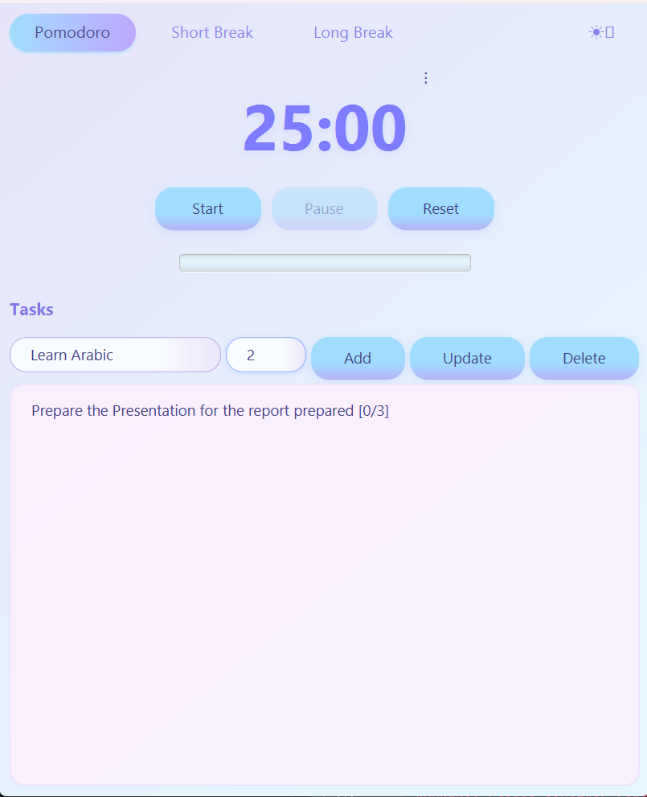
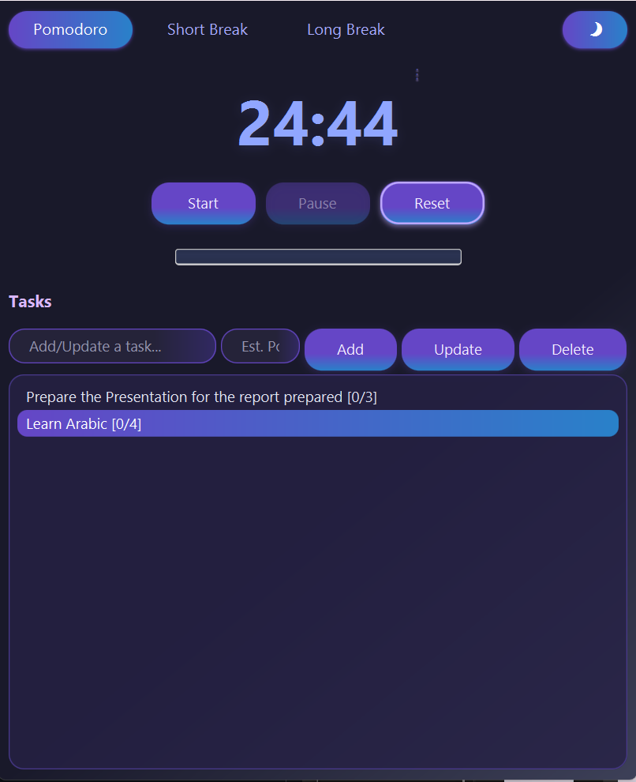
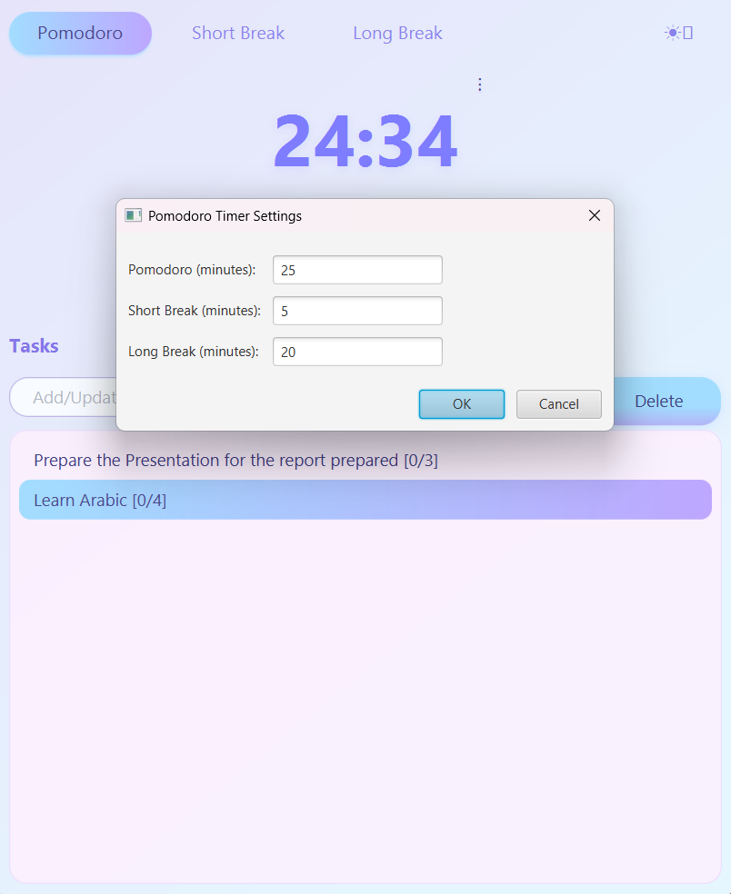

# 🕒 PomodoroFX – JavaFX Pomodoro App

A simple and modern Pomodoro timer built using JavaFX as part of the Visual Programming Lab.  
It helps improve focus using the 25-5 Pomodoro technique, with automation, task tracking, and a sleek user interface.

---

## ✨ Features

- 🎨 **Modern UI** with responsive layout
- 🌗 **Light/Dark mode toggle**
- 🔄 **Automated 4-cycle Pomodoro system** (Work → Short Break → 4th Long Break)
- ✅ **Task manager** to add and track Pomodoro sessions per task

---

## 📸 Screenshots

### 🔆 Light Mode


### 🌙 Dark Mode


### 🧾 Changing the pomodoro times


---

## 🚀 How to Run

### 🔧 Prerequisites
- Liberica-full-24 JDK
- JavaFX SDK
- Maven or your preferred build tool

### ▶️ Run using CLI
```bash
git clone https://github.com/Monajir/PomoDoro-App.git
cd PomodoroFX
- Open `Main.java` in your IDE or run with a JavaFX runner.
